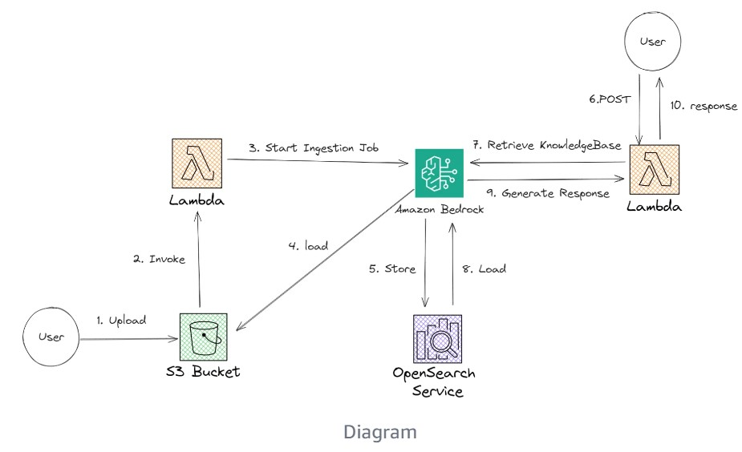

# Welcome to your CDK JavaScript project

## Useful commands

* `npm run test`         perform the jest unit tests
* `npx cdk deploy`       deploy this stack to your default AWS account/region
* `npx cdk diff`         compare deployed stack with current state
* `npx cdk synth`        emits the synthesized CloudFormation template

# Architecture



# Prerequisites

* AWS Cli

* NPM 

```console
curl -o- https://raw.githubusercontent.com/creationix/nvm/v0.33.8/install.sh | bash
nvm install node npm
npm i
```

Tested with 

NodeJS v22.3.0
npm 10.8.1

* CDK 

* Docker 

* Access to `amazon.titan-embed-text-v1` e `anthropic.claude-instant-v1` model on Bedrock

# Getting started

1. `cdk build`

2. `aws s3 sync data s3://resumeaistack-b7-kdx14wcvfzst^Cedrockragbucketdfd7a7c7-kdx14wcvfzst`

3. update .env file in `streamlit/`

4. `strealit run streamlit/main.py`

# Clean 

1. `cdk destroy`

# References

* [Easy Serverless RAG with Knowledge Base for Amazon Bedrock](https://community.aws/content/2bi5tqITxIperTzMsD3ohYbPIA4/easy-rag-with-amazon-bedrock-knowledge-base)

* [Implementing RAG App Using Knowledge Base from Amazon Bedrock and Streamlit](https://medium.com/@saikatm.courses/implementing-rag-app-using-knowledge-base-from-amazon-bedrock-and-streamlit-e52f8300f01d)
